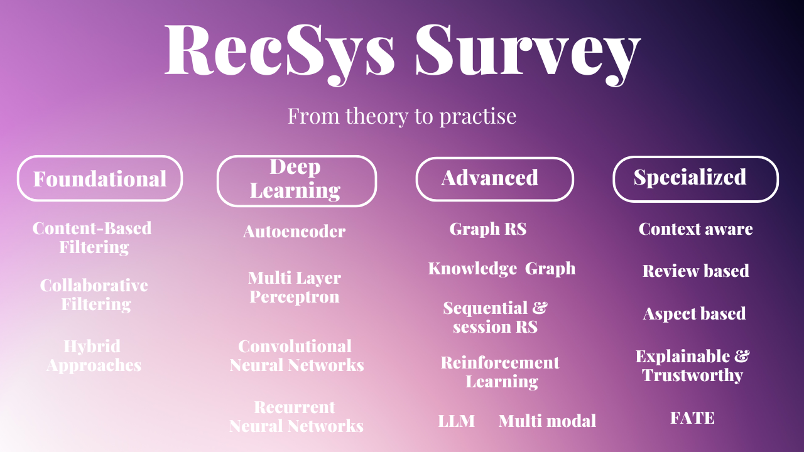

<h1 align="center">A Comprehensive Review of Recommender Systems:
Transitioning from Theory to Practice</h1>

Welcome to the official repository for the paper **"A Comprehensive Review of Recommender Systems: Transitioning from Theory to Practice"**.

This repository is dedicated to continuously exploring and disseminating knowledge on Recommender Systems. It aims to bridge theory and practice, offering valuable insights for both researchers and industry professionals.

<div align=center></div>

<br>

>**Authors**: [Shaina Raza*](https://scholar.google.com/citations?user=chcz7RMAAAAJ&hl=en), [Mizanur Rahman*](https://scholar.google.com/citations?hl=en&user=SzJtFg8AAAAJ&view_op=list_works&authuser=1), [Safiullah Kamawal](https://www.linkedin.com/in/safi-kamawal-a613a2345/?originalSubdomain=ca), [Armin Toroghi](https://scholar.google.com/citations?user=qAj_2MoAAAAJ&hl=en&oi=sra), [Ananya Raval](https://scholar.google.com/citations?user=JfJueNMAAAAJ&hl=en), [Farshad Navah](https://scholar.google.ca/citations?user=hNaei9kAAAAJ&hl=en), [Amirmohammad Kazemeini](https://scholar.google.com/citations?user=XXXXX) <br>
>**Institutions**: Vector Institute, Royal Bank of Canada, Bank of Montreal <br>
>**Published**: July 19, 2024 <br>
>**arXiv Link**: [arXiv:2407.13699v1](https://arxiv.org/abs/2407.13699) <br>

If you find our paper helpful, please cite:

```
@article{raza2024comprehensive,
  title={A Comprehensive Review of Recommender Systems: Transitioning from Theory to Practice},
  author={Raza, Shaina and Rahman, Mizanur and Kamawal, Safiullah and Toroghi, Armin and Raval, Ananya and Navah, Farshad and Kazemeini, Amirmohammad},
  journal={arXiv preprint arXiv:2407.13699},
  year={2024}
}
```

## 🔔 News
- 🔥 **[08/2024]**: Paper is under review at Elsevier Computer Science Review (IF = 13.3)

## 📌**Table of Contents**
1. [Introduction](#introduction)
2. [Key Contributions](#key-contributions)
3. [Paper Summary](#summary)
4. [Highlighted Papers](#highlighted-papers)
5. [Challenges in Recommender Systems](#challenges-in-recommender-systems)
6. [Advanced Techniques](#advanced-techniques)
7. [Impact of the Research](#Impact-of-the-research)
8. [Limitations](#limitations)
9. [Future Directions](#future-directions)

## 🔍**Introduction**
This survey acts as a comprehensive benchmark and cookbook to determine where, when, and why specific recommender system methodologies from academia should be applied across various industry sectors. It covers advancements in recommender systems from 2017 to 2024, and includes 65 pages of in-depth analysis with over 500 references. The document features 11 comprehensive analysis tables and addresses 19 sets of recommender system techniques, ranging from traditional methods to advanced specialized AI techniques, across ten diverse sectors including e-commerce, healthcare, and finance.

## Key Contributions
1. Comprehensive review tracing the development of RS from 2017 to 2024.
2. Around 500+ high impact papers were reviewed. 
3. Thorough examination of different RS types, challenges, datasets, and metrics.
4. Emphasis on bridging theoretical advancements with real-world applications.
5. Highlights on emerging trends such as **Explainable AI**, **FATE (Fairness, Accountability, Transparency, Ethics)**, and **Large Language Models**.

## Summary
This paper presents a comprehensive exploration of the development of Recommender Systems (RS), beginning with traditional techniques such as content-based filtering, collaborative filtering, and hybrid approaches. While these traditional RS have been widely implemented, they encounter significant challenges in adapting to dynamic user preferences, providing real-time recommendations, and addressing issues such as the cold start problem and data privacy. To overcome these limitations, there is a clear need for more advanced methods, particularly those involving deep learning.

In response to these challenges, the paper transitions to discussing advanced methods, including four key deep learning models such as Autoencoders. These models have substantially improved the ability to personalize recommendations and capture complex user-item interactions, resulting in enhanced performance in sectors like e-commerce, news, and entertainment. The evolution of these models has further led to the development of even more sophisticated techniques, such as Graph Neural Networks (GNNs), which are capable of boosting both accuracy and diversity in recommendations. These advancements are explored in detail within the section on advanced modeling techniques.

Building on the discussion of deep learning, the paper delves into six advanced modeling techniques, including graph-based models, reinforcement learning, and large language models. Additionally, it examines six specialized RS areas, such as context-aware, review-based, and fairness-aware systems. These specialized RS are tailored to address unique user preferences and situations across various domains. Unlike general RS, these systems focus on specialized functions and targeted recommendations, utilizing advanced techniques to deliver context-aware, review-based, aspect-based, explainable, and fairness-focused recommendations.

The overarching goal of this survey is to bridge the gap between theoretical advancements and practical applications in RS. By addressing challenges across 10 diverse sectors, including e-commerce, healthcare, and finance, the paper emphasizes the importance of developing scalable, real-time, and trustworthy RS solutions. Furthermore, the survey highlights how these advancements are already being applied in industry settings to tackle domain-specific challenges. The insights provided are intended to guide industry professionals in optimizing RS deployment and to inspire future research, particularly in addressing the emerging technological and societal trends that will shape the future of Recommender Systems.

## Highlighted Papers

#### Foundational Recommender Systems:

- [01/2013] **Probabilistic Models for Unified Collaborative
and Content-Based Recommendation in Sparse-Data Environments** *Alexandrin Popescul et. al. arXiv.* [[paper]](https://arxiv.org/abs/1301.2303)
- [01/2018] **Joint Deep Modeling of Users and Items Using Reviews for Recommendation** *Lei Zheng et. al arXiv* [[paper](https://arxiv.org/abs/1701.04783)]
- [02/2018] **Content-Based Citation Recommendation** *Chandra Bhagavatula et. al arXiv* [[paper](https://arxiv.org/abs/1802.08301)]
- [1999] **An algorithmic framework for performing collaborative filtering** *Jonathan L. Herlocker et. al SIGIR'99* [[paper](https://doi.org/10.1145/312624.312682)]
- [2001] **Item-based collaborative filtering recommendation algorithms** *Badrul Sarwar et. al KDD'99* [[paper](https://doi.org/10.1145/371920.372071)]
- [2012] **Factorization machines with libfm** *S Rendle TIST'12* [[paper](https://doi.org/10.1145/2168752.2168771)]
- [06/2016] **Wide & Deep Learning for Recommender Systems** *Heng-Tze Cheng et. al arXiv* [[paper](https://arxiv.org/abs/1606.07792)]
- [08/2017] **Neural Factorization Machines for Sparse Predictive Analytics** *Xiangnan He et. al arXiv* [[paper](https://arxiv.org/abs/1708.05027)]
- [03/2017] **DeepFM: A Factorization-Machine based Neural Network for CTR Prediction** *Huifeng Guo et. al arXiv* [[paper](https://arxiv.org/abs/1703.04247)]
- [08/2009] **Matrix Factorization Techniques for Recommender Systems** *Yehuda Koren et. al IEEE Computer Society Press* [[paper](https://doi.org/10.1109/MC.2009.26)]

#### Graph-based Recommender Systems:
  
- [07/2021] **Dynamic Graph Neural Networks for Sequential Recommendation** *Mengqi Zhang et al. arXiv.* [[paper](https://arxiv.org/abs/2104.07368)]
- [11/2019] **Graph Neural Networks for Social Recommendation** *Wenqi Fan et al. arXiv.* [[paper](https://arxiv.org/pdf/1902.07243)]
- [06/2019] **KGAT: Knowledge Graph Attention Network for Recommendation** *Xiang Wang et al. arXiv.* [[paper](https://arxiv.org/pdf/1905.07854)]
- [06/2017] **Graph Convolutional Matrix Completion** *Rianne van den Berg et. al arXiv* [[paper](https://arxiv.org/abs/1706.02263)]
- [02/2020] **LightGCN: Simplifying and Powering Graph Convolution Network for Recommendation** *Xiangnan He et. al arXiv* [[paper](https://arxiv.org/abs/2002.02126)]
- [05/2019] **Neural Graph Collaborative Filtering** *Xiang Wang et. al arXiv* [[paper](https://arxiv.org/abs/1905.08108)]

#### Sequential and Session-based Recommender Systems: 
- [08/2023] **Knowledge Prompt-tuning for Sequential Recommendation** *Jianyang Zhai et al. arXiv.* [[paper](https://arxiv.org/pdf/2308.08459)]
- [05/2023] **Frequency Enhanced Hybrid Attention Network for Sequential Recommendation** *Xinyu Du et al. arXiv.* [[paper](https://arxiv.org/pdf/2304.09184)]
- [04/2022] **CORE: Simple and Effective Session-based Recommendation within Consistent Representation Space** *Yupeng Hou et al. arXiv.* [[paper](https://arxiv.org/pdf/2204.11067)]
- [04/2019] **BERT4Rec: Sequential Recommendation with Bidirectional Encoder Representations from Transformer** *Fei Sun et. al arXiv* [[paper](https://arxiv.org/abs/1904.06690)]
- [11/2015] **Session-based Recommendations with Recurrent Neural Networks** *Balázs Hidasi et. al arXiv* [[paper](https://arxiv.org/abs/1511.06939)]
- [07/2017] **Translation-based Recommendation** *Ruining He et. al arXiv* [[paper](https://arxiv.org/abs/1707.02410)]
- [09/2018] **Personalized Top-N Sequential Recommendation via Convolutional Sequence Embedding** *Jiaxi Tang et. al arXiv* [[paper](https://arxiv.org/abs/1809.07426)]
- [08/2018] **Self-Attentive Sequential Recommendation** *Wang-Cheng Kang et. al arXiv* [[paper](https://arxiv.org/abs/1808.09781)]
- [11/2018] **Session-based Recommendation with Graph Neural Networks** *Shu Wu et. al arXiv* [[paper](https://arxiv.org/abs/1811.00855)]


#### Knowledge-based Recommender Systems: 
- [12/2023] **DiffKG: Knowledge Graph Diffusion Model for Recommendation** *Yangqin Jiang et. al arXiv.* [[paper](https://arxiv.org/pdf/2312.16890)]
- [06/2021] **Personalized News Recommendation with Knowledge-aware Interactive Matching** *Tao Qi et al. arXiv.* [[paper](https://arxiv.org/pdf/2104.10083)]
- [06/2019] **Reinforcement Knowledge Graph Reasoning for Explainable Recommendation** *Yikun Xian et. al arXiv.* [[paper](https://arxiv.org/pdf/1906.05237)]
- [07/2017] **Translation-based Recommendation** *Ruining He et. al arXiv* [[paper](https://arxiv.org/abs/1707.02410)]
- [07/2018] **node2vec: Scalable Feature Learning for Networks** *Aditya Grover et. al arXiv* [[paper](https://arxiv.org/abs/1607.00653)]
- [2013] **Translating embeddings for modeling multi-relational data.** *Antoine Bordes et. al NIPS'13* [[paper](https://proceedings.neurips.cc/paper_files/paper/2013/file/1cecc7a77928ca8133fa24680a88d2f9-Paper.pdf)]
- [2014] **Personalized entity recommendation: a heterogeneous information network approach** *Xiao Yu et. al WSDM'14* [[paper](https://dl.acm.org/doi/10.1145/2556195.2556259)]

####  Reinforcement Learning-based Recommender Systems
- [12/2018] **Generative Adversarial User Model for Reinforcement Learning Based Recommendation System** *Xinshi Chen et. al arXiv* [[paper](https://arxiv.org/abs/1812.10613)]
- [2018] **DRN: A Deep Reinforcement Learning Framework for News Recommendation** *Guanjie Zheng et. al WWW'18* [[paper](https://dl.acm.org/doi/fullHtml/10.1145/3178876.3185994)]

####  Large Language Model based Recommender Systems: 
- [03/2024] **RecMind: Large Language Model Powered Agent For Recommendation** *Yancheng Wang et al. arXiv.* [[paper](https://arxiv.org/pdf/2308.14296)]
- [04/2023] **Prompt Learning for News Recommendation** *Zizhuo Zhang et al. arXiv.* [[paper](https://arxiv.org/pdf/2304.05263)]
- [02/2023] **Recommendation as Language Processing (RLP): A Unified Pretrain, Personalized Prompt & Predict Paradigm (P5)** *Shijie Geng et al. arXiv.* [[paper](https://arxiv.org/pdf/2203.13366)]
- [07/2023] **Large Language Models are Competitive Near Cold-start Recommenders for Language- and Item-based Preferences** *Scott Sanner et. al arXiv* [[paper](https://arxiv.org/abs/2307.14225)]
- [03/2022] **Recommendation as Language Processing (RLP): A Unified Pretrain, Personalized Prompt & Predict Paradigm (P5)** *Shijie Geng et. al arXiv* [[paper](https://arxiv.org/abs/2203.13366)]
- [05/2023] **Large Language Models are Zero-Shot Rankers for Recommender Systems** *Yupeng Hou et. al arXiv* [[paper](https://arxiv.org/abs/2305.08845)]

#### Multimodal Recommender Systems
- [10/2015] **VBPR: Visual Bayesian Personalized Ranking from Implicit Feedback** *Ruining He et. al arXiv* [[paper](https://arxiv.org/abs/1510.01784)]
- [2017] **Attentive Collaborative Filtering: Multimedia Recommendation with Item- and Component-Level Attention** *Jingyuan Chen et. al SIGIR'17* [[paper](https://dl.acm.org/doi/10.1145/3077136.3080797)]
- [02/2023] **Multi-Modal Self-Supervised Learning for Recommendation** *Wei Wei et. al arXiv* [[paper](https://arxiv.org/abs/2302.10632)]
- [04/2018] **CoNet: Collaborative Cross Networks for Cross-Domain Recommendation** *Guangneng Hu et. al arXiv* [[paper](https://arxiv.org/abs/1804.06769)]

#### Specialized Recommender Systems
- [2014] **Explicit factor models for explainable recommendation based on phrase-level sentiment analysis** *Yongfeng Zhang et. al SIGIR'14* [[paper](https://dl.acm.org/doi/10.1145/2600428.2609579)]
- [08/2017] **Attentional Factorization Machines: Learning the Weight of Feature Interactions via Attention Networks** *Jun Xiao et. al arXiv* [[paper](https://arxiv.org/abs/1708.04617)]
- [2018] **A 3NCF: An Adaptive Aspect Attention Model for Rating Prediction** *Zhiyong Cheng et. al ijcai'18* [[paper](https://www.ijcai.org/proceedings/2018/0521.pdf)]
- [2018] **ANR: Aspect-based Neural Recommender** *Jin Yao Chin et. al CIKM'18* [[paper](https://arxiv.org/pdf/2407.13699)]
- [2023] **Restaurant survival prediction using customer-generated content: An aspect-based sentiment analysis of online reviews** *Hengyun Li et. al Elsevier* [[paper](https://www.sciencedirect.com/science/article/abs/pii/S0261517722002205)]
- [2022] **Aspect-based sentiment analysis via affective knowledge enhanced graph convolutional networks** *Bin Liang et. al Knowledge based systems* [[paper](https://dl.acm.org/doi/10.1016/j.knosys.2021.107643)]
- [2019] **Transparent, Scrutable and Explainable User Models for Personalized Recommendation** *Krisztian Balog et. al SIGIR'19* [[paper](https://dl.acm.org/doi/10.1145/3331184.3331211)]

Explore the **[Complete List](https://arxiv.org/pdf/2407.13699)(#)** of referenced works.

## Challenges in Recommender Systems
Key challenges:
1. Balancing **personalization** and **privacy**.
2. Addressing **cold-start** problems.
3. Ensuring **diversity and fairness** in recommendations.
4. Handling large-scale **real-time data** in **e-commerce**, **healthcare**, and **news**.

## Advanced Techniques
Explore state-of-the-art models:
- **Deep Learning**:
  - Neural Collaborative Filtering (NCF)
  - Variational Autoencoders (VAE)
- **Graph Neural Networks**:
  - LightGCN, KGAT
- **Transformer Models**:
  - BERT4Rec, Transformers4Rec
 
## Impact of the Research

This review profoundly influences future research and industry practices in Recommender Systems (RS). It highlights areas needing further investigation, particularly in advanced modeling techniques Graph neural networks, Knowledge based, LLMs and many recent methods. The detailed summaries and 11 comprehensive analysis tables serve as educational tools and practical guides for industry professionals. By tracing the evolution of RS, the paper offers insights into how theoretical advancements can address real-world challenges in sectors like e-commerce, healthcare, and finance, bridging the gap between theory and practice. 

---

## Limitations

Despite significant advancements, current Recommender Systems (RS) face critical limitations, including challenges in scalability, adaptability, and computational efficiency, particularly in dynamic and real-time environments. These systems often struggle with integrating diverse data sources, maintaining transparency, and addressing ethical concerns such as bias and privacy issues. Additionally, the heavy reliance on explicit feedback and the substantial computational resources required for deep learning models further complicate their deployment, especially for smaller organizations.

---

## Future Directions
The survey emphasizes:
- Real-time, scalable RS solutions.
- Integration of **Explainable AI** for user trust.
- Expanding RS applications in healthcare, finance, and education.

Future works in RS must focus on responsible AI practices to minimize biases and prevent the spread of misinformation. Evaluating RS beyond accuracy, with an emphasis on diversity and serendipity, will be crucial for enhancing user experiences. The growing need for transparency and explainability requires more interpretable models. Addressing computation and storage challenges by developing on-device RS can improve efficiency and privacy. Additionally, exploring causality in recommendations and leveraging generative AI for conversational RS must be done with a focus on safety and responsible practices.

---

**Target Audience:**

- **Researchers and Students**: A guide for theory and practice.
- **Industry Professionals and Engineers**: A cookbook for applying state-of-the-art techniques.
- **Tech Companies and Startups**: Insights on integrating advanced RS solutions and staying updated on trends.

## 📫 **Contact**
For queries or collaborations:
- **Email**: [shaina.raza@vectorinstitute.ai], [mizanur.rahman@rbc.com], [amirmohammad.kazemeini@vectorinstitute.ai]
- **Contributions**: Feel free to submit a pull request for updates or suggestions!

---

## 🎉 **Contributions and Feedback**
We welcome your feedback and contributions to make this repository a valuable resource for the RS community. Follow for updates!
